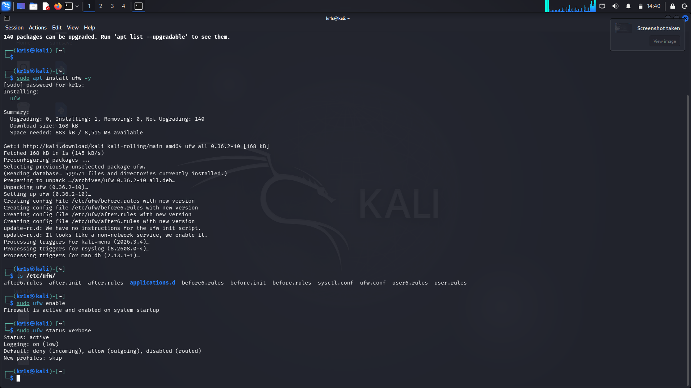
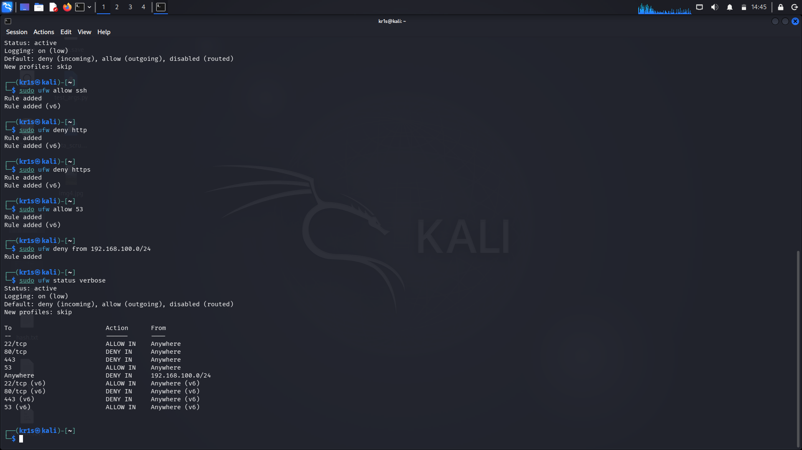
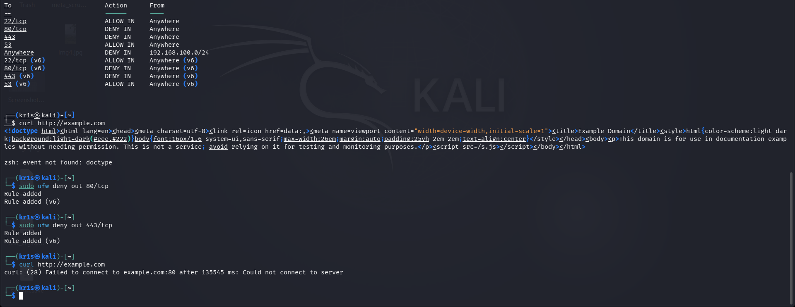

# Task 2: Basic Firewall Configuration with UFW

## Objective
Set up and configure a basic firewall on a Linux system using UFW (Uncomplicated Firewall), applying rules to allow and deny specific types of traffic.

## Environment
- **OS:** Kali Linux (VM)
- **Tool:** UFW (Uncomplicated Firewall)

## Rules Applied

| # | Rule | Command | Purpose |
| :--- | :--- | :--- | :--- |
| 1 | Allow SSH (inbound) | `sudo ufw allow ssh` | Enable remote management via SSH |
| 2 | Deny HTTP (inbound) | `sudo ufw deny http` | Block incoming unencrypted web traffic |
| 3 | Deny HTTPS (inbound) | `sudo ufw deny https` | Block incoming encrypted web traffic |
| 4 | Allow DNS (inbound) | `sudo ufw allow 53` | Allow DNS resolution |
| 5 | Deny Subnet (inbound) | `sudo ufw deny from 192.168.100.0/24` | Block a potentially hostile subnet |
| 6 | Deny HTTP (outbound) | `sudo ufw deny out 80/tcp` | Prevent outbound unencrypted web traffic |
| 7 | Deny HTTPS (outbound) | `sudo ufw deny out 443/tcp` | Prevent outbound encrypted web traffic |

## Why These Rules Were Chosen
- **SSH allowed:** Needed for remote administration.
- **HTTP/HTTPS denied (inbound):** Prevents incoming web traffic.
- **DNS allowed:** Required for domain name resolution.
- **Subnet denied:** Demonstrates blocking a specific network range.
- **HTTP/HTTPS denied (outbound):** Prevents outbound web requests.

## The Inbound vs. Outbound Lesson
Initially, I only applied `DENY IN` rules for HTTP and HTTPS. When I tested with `curl http://example.com`, the request succeeded because:
- The `DENY IN` rule only blocks **incoming** connections.
- My machine was **initiating** an outbound connection.

To fully block web browsing, I added:
**sudo ufw deny out 80/tcp**
**sudo ufw deny out 443/tcp**

## Testing
- **HTTP Blocked:** `curl http://example.com` → `curl: (28) Failed to connect after 135545 ms`
- **SSH Allowed:** `ssh localhost` → connected successfully

## Script
Run `ufw_configuration.sh` to apply all rules automatically.

## Key Learnings
- UFW provides a simple interface for managing iptables rules.
- Inbound vs. outbound rules are fundamentally different.
- Rule order matters.
- Testing is critical for verification.

- ### ⚠️ Real-World Lesson: Self-Inflicted Firewall Lockout
During this task, I accidentally locked myself out of the internet by applying `DENY OUT` rules for HTTP and HTTPS before installing the necessary tools. This is a common mistake in production environments — if you block outbound traffic before you're done configuring the system, you can't download packages or updates.

**Fix:** I temporarily allowed outbound HTTPS to install required packages, then re-applied the deny rules afterward. This taught me the importance of **firewall change management** and always keeping a way to restore access.

## Screenshots

